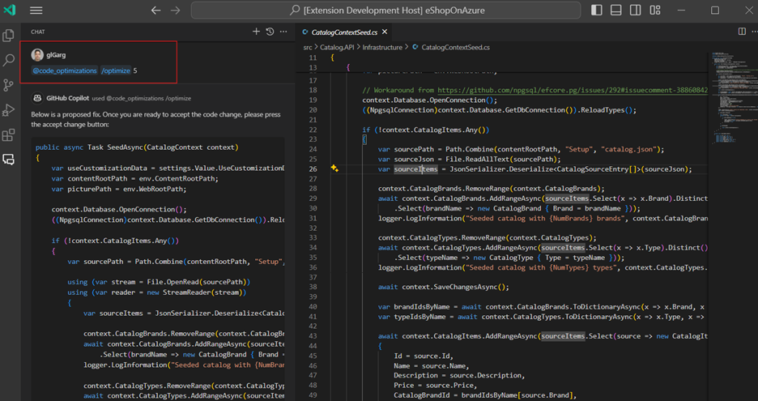

# Table of Contents
1. [PREREQUISITES](#Prerequisites)
2. [INSTALLATION](#Installation)
3. [USAGE](#Usage)
   a. [Option 1: With Code Optimizations (more setup time required, but more accurate fixes)](#Option1)
   b. [Option 2: Without Code Optimizations (less setup time required, but less accurate fixes)](#Option2)

# Prerequisites 
## GitHub Account
For the extension to work, we need your GitHub account to meet the following criteria:
1.	**Have a Copilot subscription.** If you don’t have it, this page explains how you can get it for free: [Copilot organization | Microsoft Open Source Management](https://repos.opensource.microsoft.com/orgs/MicrosoftCopilot).
2.	**Be within [Copilot-Code-Optimizations](https://github.com/copilot-code-optimizations) org on GitHub with a public affiliation.** Your membership needs to be public.

A quick way to verify that is to search for your GitHub username within the members list and see if the affiliation is public, as indicated in the screenshot. Our extension needs to be able to see your account in the org to authenticate you.

- [Members · People · copilot-code-optimizations (github.com)](https://github.com/orgs/copilot-code-optimizations/people)

## VS Code Insiders

1)	Make sure to have the latest version of [VS Code Insiders](https://code.visualstudio.com/insiders/).  
2)	If not already installed, install GitHub Copilot Chat extension and log in with your Copilot-Code-Optimizations affiliated GitHub account.

## az login

For the final prerequisite step, open a new terminal then enter the command `az login`.

# Installation 

Download the [VSIX file](https://...) from this current repo. Always use this repo as it will have the latest version of the extension.

Note: Do not double click on the VSIX as this will not install it correctly. Instead install it through VS Code itself. Click on extensions icon on the left-hand side, then using the triple dot icon select the “Install from VSIX ...” option, as shown below:

Find and select the downloaded VSIX file from the file menu, then press okay. Wait for the extension to install. Once installed, it should show you the following message at the bottom right corner of your VS Code window:

This will also trigger the authentication process. If you’re installing the extension for the first time, it will take you through GitHub authentication process and ask for permissions to see your memberships. Hit accept.

# Usage 

## Option 1: With Code Optimizations (more setup time required, but more accurate fixes) 

### Code Optimizations

Do you have Azure Application Insights and Application Insights Profiler enabled for your .NET service? If not, you have two options:
1. Click the following links to set up [Application Insights](https://learn.microsoft.com/en-us/azure/azure-monitor/app/create-workspace-resource?tabs=bicep) and [Application Insights Profiler](https://learn.microsoft.com/en-us/azure/azure-monitor/profiler/profiler).
2. If you don't want to set those up, go to [Option 2](#Option2) for a lightweight version of the VS Code Extension.

If you already have those set up, go into the performance blade of your Application Insights resource and click on “Code Optimizations” as shown below (underlined):

Once you’re in Code Optimizations, you should see something such as the following. By default, Code Optimizations shows you insights from the last 24 hours. It’s possible that there aren’t any insights if there haven’t been any profiles in the last 24 hours or none of the profiles analyzed have issues. In this case, you can change the time range to a larger window like 7 days or 30 days:

Now that we’ve seen some insights, it’s time to go fix them! The next part of the doc focuses on how the VS Code extension can be used to fix these Code Optimizations issues.

### VS Code Extension

Open the repo you have insights for in Code Optimizations. Our extension introduces an agent called `@code_optimizations` with two commands or *skills* that let you interface with Code Optimizations issues. To invoke our extension, you would need to type `@code_optimizations` followed by the skill and the necessary parameters:

#### @code_optimizations /connect

To use this command, you will need the App ID for your application. Go to your Application Insights resource and in the top right search bar, type in "api" and click on `API Access`, as shown in the screenshot below:

You should see your App ID on the right.

Once you have the App ID, the connect command can be used as follows: `@code_optimizations /connect <app id>`. Below is a screenshot of what the result may look like:

The command will pull in the top issues from Code Optimizations, map them to source code in your local repo and try suggesting fixes / recommendations.

#### @code_optimizations /optimize

The `@code_optimizations /optimize` command can be used in the following two ways:
1.	`@code_optimizations /optimize <issue number>`: We call optimize along with the GitHub issue id for an issue created by Code Optimizations service in Azure Portal. This is typically used in conjunction with the `/issues` command via the “Generate Fix!” button (as seen in the above screenshot). Example usage: `@code_optimizations /optimize 5`, where `5` is the ID of the GitHub issue we would like to fix.
2.	Code selection + `@code_optimizations /optimize`: The other way to use `/optimize` is to directly trigger it on some code, in case the user wants to proactively optimize some code they think has a perf issue. The user would first select some code they think is problematic or place their cursor in a method that has some perf issue and then call the `/optimize` command in Copilot chat.

The issue number is the ID of a GitHub issue created by Code Optimizations. The command will then pull in body of the issue, which contains details like the call stack, CPU usage, etc. It then uses the call stack to find the relevant code and then use our model to generate a code fix. Allow the model endpoint some time to generate the fix. Below is an example of what a usage may look like:

Once the fix is generated, it should show you two buttons to preview a diff of the fix with the original file and then merge the changes:

In our diff view, we also provide the inline chat which can be used to make any further changes to the suggestion. Potential queries, could be “Update method name from A to B” or “Use API X instead of Y”, etc.

Once the changes are merged, we recommend running some benchmark/load tests to ensure the changes improve performance and any unit tests to make sure code semantics are preserved.

## Option 2: Without Code Optimizations (less setup time required, but less accurate fixes) 

If you want to optimize some arbitrary .NET code, you can also use our `/optimize` skill directly on it. Just select some code or place your cursor in a method you wish to optimize and type `@code_optimizations /optimize` in Copilot chat. Below is a screenshot of what this could look like:

We can see that user has selected some code and then called `@code_optimizations /optimize` directly in the chat!

# Feedback
Your feedback is important to us! If you have any questions or suggestions, please reach out to our email alias: codeoptimizations@microsoft.com.

## Trademarks

This project may contain trademarks or logos for projects, products, or services. Authorized use of Microsoft 
trademarks or logos is subject to and must follow 
[Microsoft's Trademark & Brand Guidelines](https://www.microsoft.com/en-us/legal/intellectualproperty/trademarks/usage/general).
Use of Microsoft trademarks or logos in modified versions of this project must not cause confusion or imply Microsoft sponsorship.
Any use of third-party trademarks or logos are subject to those third-party's policies.
